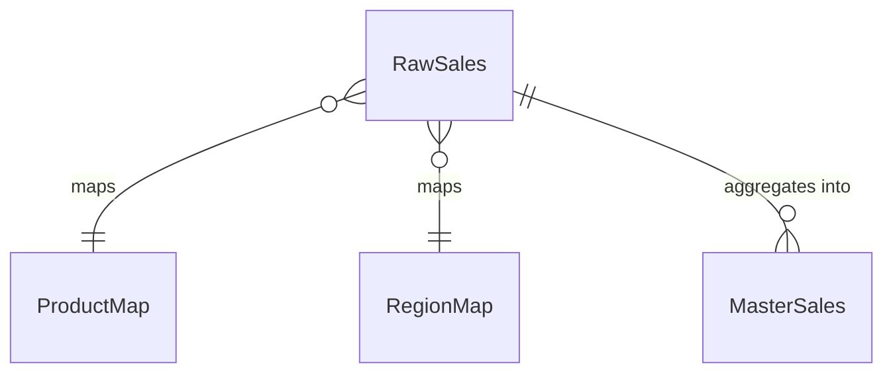

# 11 — Reading List & Tools

[← Back to index](README.md) · [← Cheat Sheet](10-cheatsheet.md)

What's actually worth your time, and what each thing is for.

---

## If you read two things

**Kimball & Ross — *The Data Warehouse Toolkit* (3rd ed.)**
The canonical text on exactly this workflow: raw → staging → dimensional model. Facts vs. dimensions, grain, slowly changing dimensions, why your `ref.*` tables are dimensions and `mart.MasterSales` is a fact table. Reads as design philosophy, not syntax. **If you buy one book, buy this.**

**Learn to read execution plans.** Not a book — a skill. It's the difference between guessing at performance and knowing. Grant Fritchey's book below is the fastest route.

Everything else follows from those two.

---

## Design & modeling

**Kimball & Ross — *The Data Warehouse Toolkit***
As above. The industry's shared vocabulary for analytical data modeling.

**Louis Davidson — *Pro SQL Server Relational Database Design and Implementation***
Normalization, keys, constraints, the modeling decisions that are hard to reverse. Drier than Kimball, and it's the missing manual for the choices you make before the dimensional layer.

**Martin Kleppmann — *Designing Data-Intensive Applications***
Not SQL Server–specific, and the best book on this list for *thinking*. Replication, consistency models, batch vs. stream, why distributed systems are hard. Read it when you start wondering how the pieces fit together at scale.

---

## T-SQL

**Itzik Ben-Gan — *T-SQL Fundamentals***
Approachable, thorough, correct. Start here even if you already write SQL daily — the chapters on NULL handling and logical query processing order will fix misconceptions you didn't know you had.

**Itzik Ben-Gan — *T-SQL Querying***
Dense, advanced, and it will genuinely change how you write SQL. Window functions, `APPLY`, gaps-and-islands, optimization patterns. Read `Fundamentals` first.

**Ben-Gan et al. — *T-SQL Window Functions***
A whole book on the topic. Worth it — window functions are the highest return per hour of any T-SQL subject.

---

## Performance

**Grant Fritchey — *SQL Server Query Performance Tuning***
Execution plans, statistics, indexing, why things are slow. The book that makes "wrapping a column in a function kills your index" click permanently.

**Kalen Delaney et al. — *SQL Server Internals***
How the engine actually works — storage, logging, locking, memory. Read when you want to understand *why* rather than *what*. Heavy, and worth it eventually.

---

## Operations

**Microsoft Learn** — the official docs are genuinely good now, and they're versioned. `learn.microsoft.com/sql`

**Brent Ozar's blog + First Responder Kit** — free, and worth more than it should be.

```
sp_Blitz          -- overall health check: tells you what's wrong with your server
sp_BlitzIndex     -- index analysis: missing, duplicate, unused
sp_BlitzCache     -- worst queries in the plan cache
sp_BlitzFirst     -- what's happening right now
```

Run `sp_Blitz` and `sp_BlitzIndex` against your database once you've built something. They produce a prioritized list of real problems with explanations, and they'll teach you as much as a book.

**Ola Hallengren's Maintenance Solution** — `ola.hallengren.com`. Free, battle-tested, the de facto standard for backup, integrity check, and index maintenance jobs. Install it rather than writing your own. This is not a compromise; it's better than what you'd build.

**Paul Randal / SQLskills blog** — corruption, recovery, internals. Paul wrote `DBCC CHECKDB`. When something is corrupt, his posts are where the answer is.

---

## Blogs & communities

| Source | Best for |
|---|---|
| **Brent Ozar** (brentozar.com) | Practical performance, opinionated, funny, free tools |
| **SQLskills** (sqlskills.com/blogs) | Deep internals, corruption, recovery |
| **Erik Darling** (erikdarling.com) | Query tuning, sharp and specific |
| **Simple Talk** (red-gate.com/simple-talk) | Broad, well-edited articles |
| **dba.stackexchange.com** | Actual answers to actual problems |
| **SQLPerformance.com** | Aaron Bertrand and others on optimization |

---

## Tools

### Editors & IDEs

**SQL Server Management Studio (SSMS)** — still the most complete tool for administration. Free.

**VS Code + the MSSQL extension** — the modern path, and it's caught up considerably. Schema Designer and Schema Compare both reached general availability in v1.35, along with local SQL Server containers for development. Right-click a database → *Visualize and Design Schema* gives you an interactive diagram that generates read-only T-SQL for whatever you do in the GUI.

> **Caution:** its Publish Changes feature deploys via DacFX. DacFX is solid, but a visual change to a column type can still become a full table rebuild. **Always read the generated script before applying**, especially against anything with real row counts.

**Schema Compare** is arguably the more valuable half of that extension — diff dev against prod, see exactly what drifted, apply selectively. That's the pain point you hit the moment you have two environments.

**Azure Data Studio** — Microsoft has been consolidating toward VS Code + the MSSQL extension. Check current status before investing in it.

**DBeaver** — free, cross-platform, connects to everything, generates ER diagrams from existing databases. Good for "what does this thing I inherited look like."

### Diagramming

**dbdiagram.io** — you type DBML, it draws the ERD. Browser-based, and there's now an official VS Code extension (`dbdiagram.dbdiagram-vscode`) with live preview and the ability to generate DBML from a database connection. Several third-party DBML preview extensions exist too.

The reason it's genuinely useful rather than a novelty: **DBML is an open format with a CLI.**

```bash
npm i -g @dbml/cli
sql2dbml schema.sql --mssql -o schema.dbml    # your DDL → diagram source
dbml2sql schema.dbml --mssql -o schema.sql    # diagram source → CREATE TABLEs
```

Point it at the DDL scripts already in your repo, get a `.dbml`, and the diagram lives next to the schema and **diffs like text**. That's the thing visual tools normally can't do.

**Mermaid `erDiagram`** — renders natively in GitHub markdown and VS Code preview. Uglier, but it's a fenced code block in a README with nothing to install:

````

````

**SSMS Database Diagrams** — ancient and buggy. Fine for *viewing*. Don't author schema with it; it generates change scripts that occasionally do table rebuilds you didn't ask for.

### Deployment

**SSDT database projects** (Visual Studio) — state-based deployment. Schema as `.sql` files, builds to a DACPAC, generates the diff. Free, and the closest thing to a professional-grade standard.

**Redgate SQL Compare / SQL Source Control** — same idea, slicker, paid.

**Flyway / DbUp / Liquibase** — migration-based. Simpler mental model, popular with app developers.

### Should you use a visual designer?

**Most people code it, and that's the right call.** Not machismo — schema is code. It needs diffs, review, and a history of *why* something changed. Visual tools produce artifacts you can't meaningfully diff, and the moment two people work on it, that's the thing that hurts.

**Practical setup:** hand-write DDL in git, use the MSSQL extension's Schema Designer to *explore* and Schema Compare to *diff environments*, and run `sql2dbml` when you want a clean picture to show someone.

---

## Learning path

**Weeks 1–4 — Foundations**
Ben-Gan's *T-SQL Fundamentals*. Build the raw/ref/mart structure from scratch. Write one refresh procedure. Get it running on a schedule.

**Weeks 5–8 — Design**
Kimball's *Data Warehouse Toolkit*, at least parts 1–2. Revisit your grain decisions with the vocabulary you now have. Add reconciliation and logging.

**Weeks 9–12 — Performance**
Fritchey's *Query Performance Tuning*. Turn on Query Store. Read the actual plan for your slowest query. Run `sp_BlitzIndex`. Fix one thing and measure the difference.

**Ongoing**
- Ben-Gan's *T-SQL Querying* for depth
- Kleppmann's *DDIA* for perspective
- Brent Ozar's blog for practice
- Restore a backup every month, and time it

---

## The short version

If you only do three things:

1. **Read Kimball** for the shape of the problem
2. **Learn to read execution plans** for everything else
3. **Restore a backup**, on purpose, before you have to

---

[← Back to index](README.md)
