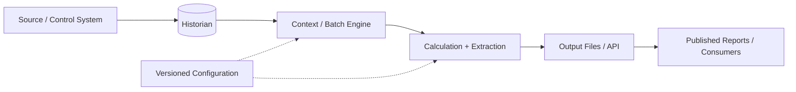
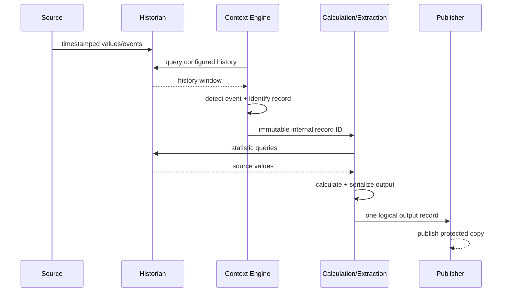

# Technical System Implementation Standard

## Front Matter

### Document Control

| Field | Value | Field | Value |
|---|---|---|---|
| Document ID | `ENG-TECH-001` | Version | `1.0` |
| Status | Issued for Use | Classification | Internal Technical |
| Owner | Engineering | Revision Date | YYYY-MM-DD |
| Prepared By | Name / Group | Approved By | Name / Group |
| Audience | Engineering, Operations, Maintenance, IT/OT |  |  |

### Revision History

| Rev | Date | Author | Change Summary |
|---:|---|---|---|
| 1.0 | YYYY-MM-DD | Engineering | Initial controlled issue. |

### Reader Guide

The document is intentionally layered. Do not flatten architecture, configuration, maintenance, security, and testing into peer sections.

| Layer | Question it answers |
|---|---|
| **Part I — System Definition** | What is the system, why does it exist, and where are its boundaries? |
| **Part II — Technical Design and Implementation** | How is it built, connected, configured, and executed? |
| **Part III — Operations and Lifecycle Support** | How is it run, changed, diagnosed, backed up, and recovered? |
| **Part IV — Assurance, Security, and Acceptance** | Who can do what, and how is correctness proven? |
| **Appendices** | What reusable component sheets, procedures, figures, and writing rules support the document? |

---

## Part I — System Definition

### 1. Document Purpose and Applicability

> **Chapter intent:** Define why the document exists, what it is authoritative for, and who should use it.

#### 1.1 Purpose and Authority

State the technical purpose in one or two sentences. State whether this document is the design record, implementation record, operations manual, maintenance reference, or a controlled combination of those roles.

#### 1.2 Scope

**In scope**

- system boundaries and components
- interfaces and data contracts
- configuration and versioning
- calculations and runtime behavior
- deployment, operations, and maintenance
- security, backup, recovery, and verification

**Out of scope**

- vendor manuals unless directly required by this implementation
- unrelated enterprise infrastructure
- process design basis that belongs in another controlled document

#### 1.3 Audience and Responsibilities

Name the roles that must be able to understand, operate, troubleshoot, modify, validate, or recover the implementation without tribal knowledge.

#### 1.4 Key Requirements and Design Decisions

> **REQ-001 — Requirement**  
> **Statement:** The implementation shall produce one deterministic output record for each valid completed production record.  
> **Verification:** Execute a controlled test record and reconcile the result to the independent source data.

> **DEC-001 — Design decision**  
> **Decision:** Separate `WIP`, `PROD`, and `PREV` configuration states.  
> **Rationale:** The active configuration and rollback baseline remain obvious and auditable.

#### 1.5 Terminology and Naming Conventions

| Term | Meaning |
|---|---|
| Source system | System that originates raw operational data. |
| Historian | Time-series store used as a durable process-data source. |
| Context engine | Logic that converts events/history into unit or batch context. |
| Characteristic | Named value stored in the context of a record. |
| Designator | Value used to uniquely identify a production record. |
| Working copy | Machine-maintained output used by generation logic. |
| Published copy | Controlled consumer-facing output. |

### 2. System Overview and Design Basis

> **Chapter intent:** Explain the complete system at a level where a qualified engineer can understand its boundary, dependencies, consumers, assumptions, and primary risks before reading implementation detail.

#### 2.1 System Boundary and Context



##### 2.1.1 Primary Data Flow

Describe how information moves from source to final output. Describe responsibilities and contracts, not merely product names.

##### 2.1.2 Configuration Flow

Describe where configuration originates, how the active revision is identified, what loads it, and how the runtime reflects that version.

#### 2.2 Design Basis and Constraints

| ID | Assumption / Constraint | Consequence if False |
|---|---|---|
| ASM-001 | Source timestamps follow the plant time standard. | Event ordering and calculation windows may be wrong. |
| ASM-002 | Record designators are unique inside the configured scope. | Duplicate or merged records may occur. |

> **RSK-001 — Risk**  
> **Condition:** Output field order can diverge from the consumer/report column order after maintenance.  
> **Consequence:** Correct values may appear under incorrect headings.  
> **Mitigation:** Treat schema and display order as one change unit and verify every field after add/delete/reorder work.

---

## Part II — Technical Design and Implementation

### 3. System Architecture

> **Chapter intent:** Define logical responsibilities and processing stages before documenting individual files, scripts, or procedures.

#### 3.1 Component Responsibilities

| Component | Responsibility | Inputs | Outputs | Failure Evidence |
|---|---|---|---|---|
| Source system | Originates real-time values/events | Process state | Tags/events | Missing or bad source values |
| Historian | Retains timestamped history | Source values | Historical queries | Query errors/gaps |
| Context engine | Detects events and creates records | History + configuration | Contextual record | Missing/duplicate record |
| Calculation layer | Computes derived/statistical values | Record timeframe + sources | Characteristics | Missing results/log errors |
| Extraction layer | Serializes configured output | Contextual record + schema | File/API row/object | Malformed/missing output |
| Publication layer | Exposes protected consumer output | Working result | Published report/dataset | Stale published timestamp |

#### 3.2 Detailed Processing Sequence



### 4. Interfaces and Data Model

> **Chapter intent:** Define each technical boundary as a contract: endpoints, transport/artifact, data, timing, ownership, and failure behavior.

#### 4.1 Interface Register

> **IF-001 — Interface**  
> **Endpoints:** Historian → Context Engine  
> **Contract:** Timestamped numeric/text values queried by tag/alias and time range.  
> **Failure behavior:** Query failure is logged and does not silently create a successful record with substituted data.

#### 4.2 Record Identity

| Field | Type | Purpose | Example |
|---|---|---|---|
| RecordYear | integer | Prevent cross-year collisions | `2026` |
| RecordNumber | integer | Human-visible record number | `1042` |
| Unit | text | Process/report unit | `R310` |
| InternalID | integer | Immutable system reference | `13279` |

#### 4.3 Output Schema

| Field | Type | Unit | Definition | Nullable? |
|---|---|---|---|---|
| BatchNumber | integer | — | Production batch identifier | No |
| StartTime | timestamp | local time | Record start | No |
| EndTime | timestamp | local time | Record end | No |
| CycleTime | decimal | min | Sum of configured active steps | Yes |
| MaxTemp | decimal | °C | Maximum process temperature over record window | Yes |

### 5. Configuration and Implementation Artifacts

> **Chapter intent:** Define what can change without code, where authoritative values live, how configuration layers depend on each other, and how artifacts are separated by lifecycle state.

#### 5.1 Configuration Layers

| Layer | Authoritative Artifact | Controls |
|---|---|---|
| Area / system | workbook/XML/YAML/database | names, hierarchy, designators, aliases, characteristics |
| Collection | per-unit configuration | triggers, event capture, sub-records, script calls |
| Calculation | list/config/code | statistic, source, window, result |
| Output | report/API schema | fields and order |
| Runtime | service/job config | host, account, schedule, retry, paths, logs |

#### 5.2 Alias / Tag Mapping

```yaml
unit: R310
aliases:
  BATCH_NUMBER: R310_BATCH_NO
  BATCH_YEAR:   R310_BATCH_YEAR
  REACTOR_TEMP: R310_TEMP_PV
  TOTAL_FEED:   R310_FEED_TOTAL
```

#### 5.3 Calculation Input Contract

```csv
Enabled,Source,Function,SubLevel2,SubLevel3,SubLevel4,SubLevel5,ResultName,Level,StartShift_s,EndShift_s
1,R310_TEMP_PV,MAX,R310,React,,,MAX_REACTOR_TEMP,3,0,0
1,R310_FEED_TOTAL,LAST,R310,,,,TOTAL_FEED,2,-600,-5
0,R310_MODE,MAX,R310,Heat,,,MODE_MAX,3,0,0
```

> **WARNING — Configuration coupling**  
> A rename, add, delete, or reorder may affect source mapping, collection configuration, calculation input, output configuration, consumer/report layout, derived calculations, validation checks, and documentation.

#### 5.4 Artifact Repository and Folder Structure

```text
PlantData/
├── CommonScripts/
│   ├── PREV/
│   ├── WIP/
│   └── PROD/
├── Documentation/
└── AreaName/
    ├── BCU/
    │   ├── PREV/
    │   ├── WIP/
    │   └── PROD/
    ├── ConfigFiles/
    ├── Debug/
    ├── InputFiles/
    ├── Logs/
    ├── Report/
    │   ├── UnitA/
    │   └── UnitB/
    └── Scripts/
        ├── PREV/
        ├── WIP/
        └── PROD/
```

- `PROD` — exact version referenced by production runtime.
- `WIP` — draft/test content; production runtime must not reference it.
- `PREV` — rollback baseline selected during the last production deployment.
- `Logs` — diagnostic evidence with a defined retention policy.

### 6. Executable Components

> **Chapter intent:** Give every script, service, scheduled job, daemon, or application a standardized one-page technical definition before showing source code.

#### 6.1 Example Component Summary — `CalculateStatistics.sql`

| Item | Description |
|---|---|
| Purpose | Calculate configured `MIN`, `MAX`, `AVG`, `SUM`, `STD`, or `LAST` values over a record timeframe. |
| Trigger | End-of-record event from the context engine. |
| Runtime Host | Application/MES server. |
| Identity | Dedicated service identity. |
| Inputs | Internal record ID, area, unit, report type, per-unit statistics list. |
| Outputs | Calculated characteristics, diagnostic log, downstream extraction trigger. |
| Dependencies | Historian, context DB, configuration path, filesystem access. |
| Failure Symptom | Required characteristics missing from completed record. |
| Recovery | Fix dependency/configuration, rerun against the same internal ID, verify results. |

#### 6.2 Example Source / Query

```sql
SELECT BatchId, MAX(ReactorTemperature) AS MaxTemp
FROM HistorianWindow
WHERE BatchId = @BatchId
GROUP BY BatchId;
```

---

## Part III — Operations and Lifecycle Support

### 7. Operations and Scheduling

> **Chapter intent:** Define recurring runtime behavior, schedule, execution identity, observable success, overlap behavior, and monitoring.

#### 7.1 Schedule and Execution Model

| Job | Schedule | Identity | Success Evidence |
|---|---|---|---|
| Context collection | Every 60 s | Service account | Current execution and no backlog |
| Output import | Daily 06:10 | Service account | New records appended exactly once |
| Publication | Daily 06:35 | Service account | Published copy newer than working copy |
| Health check | Every 15 min | Monitoring identity | All dependencies healthy |

### 8. Maintenance and Change Control

> **Chapter intent:** Convert design knowledge into safe repeatable change work with prerequisites, impact analysis, rollback, and post-change verification.

#### 8.1 PRC-001 — Generic Configuration Change

**Purpose:** Modify one controlled configuration item without losing traceability.  
**Owner:** System owner / qualified engineer  
**Prerequisites:** Approved change, production backup, test method, required access  
**Rollback:** Restore `PREV` or the exported baseline  
**Verification:** Confirm active version and execute the targeted functional test

| Step | Action / Expected Result |
|---:|---|
| 1 | Open a change record and state the reason, affected components, expected behavior, and test method. |
| 2 | Preserve current `PROD` as `PREV` or a versioned backup. Record version/hash if warranted. |
| 3 | Copy `PROD` to `WIP`; make changes only in `WIP`; increment embedded revision metadata. |
| 4 | Validate syntax/schema and test offline where supported. |
| 5 | Update every dependent artifact identified in the impact analysis. |
| 6 | Deploy the tested WIP artifact as the new PROD version. |
| 7 | Verify the runtime exposes the new version and required services/jobs are healthy. |
| 8 | Execute the predefined functional test and reconcile source → context → output. |
| 9 | If verification fails, restore PREV and re-verify the baseline. |
| 10 | Close the change with version, test evidence, anomalies, and final disposition. |

#### 8.2 Adding a New Output Data Point

Document the new field contract first: source, characteristic, data type, units, collection timing/statistic, output location, dependent calculations, expected example value, and acceptance test. Then modify collection, calculation, output configuration, and consumer schema in that order.

### 9. Troubleshooting, Backup, and Recovery

> **Chapter intent:** Diagnose by following the data path; preserve evidence; then define how the system is restored to a known state.

#### 9.1 Diagnostic Method

> **Troubleshooting rule:** Find the last stage known to be correct, then test the next interface. Avoid random restarts.

| Symptom | Check First | Likely Fault Domains |
|---|---|---|
| Record never created | Source event + historian values | source tag, trigger, designator mapping |
| Statistic missing | calculation log + input list | syntax, alias, time window, write access |
| Output missing | extraction log + schema | characteristic name, query, path/API permission |
| Published report stale | import/publish job status | scheduler, locks, path, identity |
| Wrong value under heading | schema order vs display order | stale template, field reorder, calc references |

> **CRITICAL — Preserve evidence**  
> Before restarting services, deleting files, clearing queues, or manually editing records, preserve the failed-state logs and files needed for root-cause analysis.

#### 9.2 Backup, Recovery, and Rollback

| Asset | Backup Method | Recovery Objective | Restore Verification |
|---|---|---|---|
| Configuration | Version control + issued export | Latest approved version | Version/hash + config validation |
| Database | Platform backup | Site RPO/RTO | DB consistency + targeted query |
| Report templates | Versioned file backup | Latest approved template | Open/read + controlled import |
| Logs | Retention/archive | Enough history for incident support | Retrieve by date/component |

---

## Part IV — Assurance, Security, and Acceptance

### 10. Security and Access Control

> **Chapter intent:** State execution identities, trust boundaries, least-privilege requirements, and explicitly unnecessary privileges.

#### 10.1 Identity and Access Matrix

| Identity | Used By | Required Access | Explicitly Not Required |
|---|---|---|---|
| Collector service | Context engine | Read historian, write record DB/logs | Domain admin; interactive use |
| Publisher service | Publisher | Read working outputs, write publication location | Modify source/config |
| Engineer | Maintenance tools | Controlled config/admin access by role | Service-account password reuse |
| Viewer | Consumers | Read published output | Write to working/config paths |

#### 10.2 Security Requirements

> **REQ-SEC-001 — Requirement**  
> Production automation services shall run under dedicated non-personal identities with only the permissions required for their function.

### 11. Verification, Testing, and Acceptance

> **Chapter intent:** Make every important requirement and change observable through a defined test and retained evidence.

#### 11.1 Verification Matrix

| Test ID | Objective | Method | Acceptance |
|---|---|---|---|
| TST-001 | Unique record creation | Controlled test/replay | Exactly one record with correct designators |
| TST-002 | Calculation window | Independent historian query | Values match within defined tolerance |
| TST-003 | Output mapping | Field-by-field reconciliation | No shifted/mislabeled fields |
| TST-004 | Restart behavior | Interrupt/resume a stage | No duplicate or silent loss |
| TST-005 | Rollback | Deploy test change then restore baseline | Original behavior restored |

#### 11.2 System Acceptance Test

Run one known record through the complete chain from source historian through published output. Capture the record identity and timestamps at each boundary. Acceptance requires consistent identity, complete required fields, reconciled calculations, and exactly-once publication.

---

## Appendices

### Appendix A — Standard Procedure Template

**PRC-XXX — Procedure Name**

- **Purpose:** one-sentence technical objective
- **Owner:** named role/team
- **Prerequisites:** state, access, tools, backups, dependencies
- **Rollback:** exact restoration method
- **Verification:** observable checks proving success

| Step | Action / Expected Result |
|---:|---|
| 1 | Confirm prerequisites and record current state/version. |
| 2 | Perform one controlled action. |
| 3 | Inspect status/logs before continuing. |
| 4 | Complete the change and execute the defined functional test. |
| 5 | Record evidence and update revision/change control. |

### Appendix B — One-Page Component Summary Template

| Item | Description |
|---|---|
| Name | Component / file / service name |
| Purpose | Technical responsibility |
| Host / Location | Server, controller, repository, network path |
| Trigger / Schedule | Event, caller, startup, or recurring schedule |
| Execution Identity | Service / account context |
| Inputs | Parameters, tags, tables, messages, files, APIs |
| Outputs | Records, files, messages, logs, status |
| Dependencies | Services, databases, paths, libraries, licenses |
| Configuration | Authoritative artifact and active version indicator |
| Failure Symptoms | Observable failure behavior |
| Diagnostics | Logs, queries, commands, status pages |
| Recovery | Safe restart/re-run/rollback |
| Verification | Proof of correct behavior after recovery/change |

### Appendix C — Figures, Screenshots, and Evidence

Use screenshots only when they add evidence or interaction detail. Architecture belongs in diagrams. Configuration values belong in text/tables where possible. Every figure should answer a technical question, have a caption, and be referenced from nearby text.

### Appendix D — Engineering Authoring Rules

1. Write for the next qualified engineer, not for the person who already knows the system.
2. Organize by engineering concern: **definition → design → lifecycle → assurance**.
3. Use Parts only for major reader concerns; Chapters for stable technical subjects; Sections for one concern inside a chapter.
4. Do not create a flat list of unrelated peer headings.
5. Lead with architecture and contracts; place click-by-click procedures later.
6. Map aliases, physical tags, characteristics, database columns, and display names explicitly when they differ.
7. Separate **fact**, **requirement**, **decision**, **risk**, **procedure**, and **example**.
8. State expected results in procedures whenever failure could otherwise look successful.
9. Document failure behavior and rollback, not only the happy path.
10. Use stable IDs (`REQ-`, `DEC-`, `IF-`, `RSK-`, `TST-`, `PRC-`) for important technical objects.
